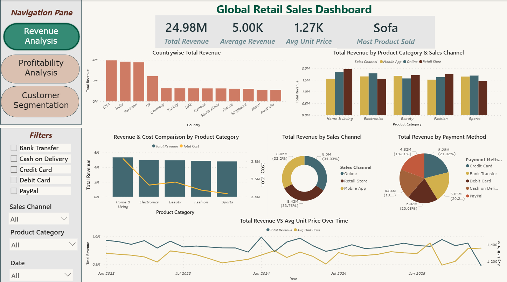
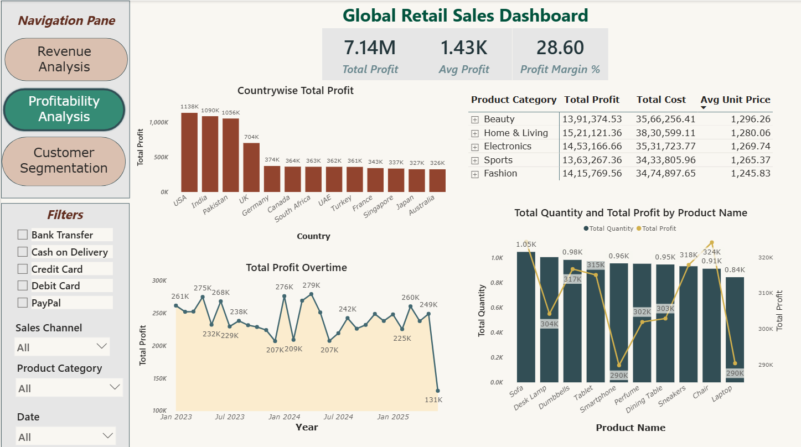
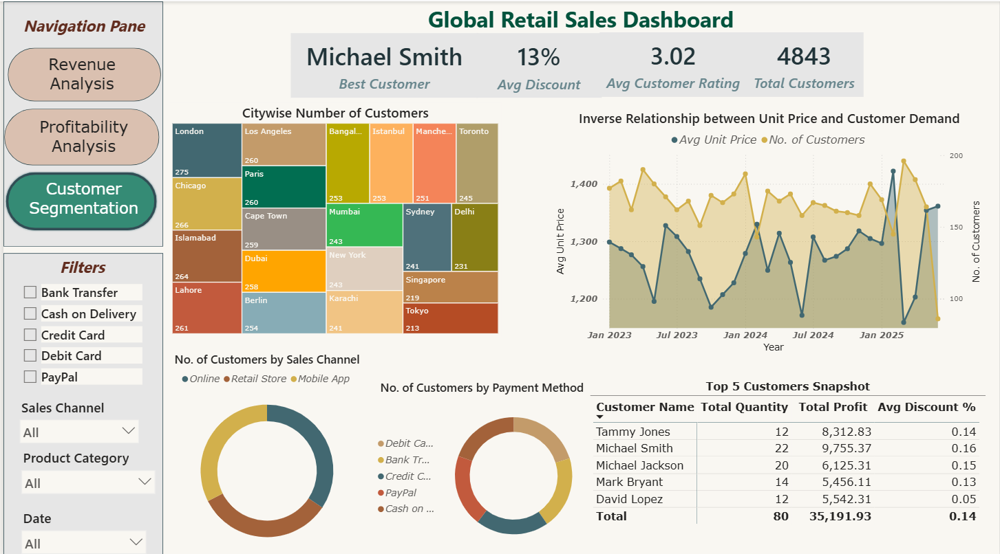

# 📊 Global Retail Sales Analysis Using Python & Power BI

## 📌 Project Overview

This repository presents a two-part analysis of a global retail sales dataset 
covering 5,000 orders across 13 countries, 3 sales channels and 5 product 
categories (2023-2025).

The Python side forms the analytical foundation - exploring the data, 
identifying business problems and answering specific questions around 
discount effectiveness, profit margins and country-channel profitability. 
The Power BI side then takes those findings and presents them through an 
interactive dashboard built for visual decision-making.

Both parts use the same dataset and together provide a complete end-to-end 
analyst workflow - from raw data to business insight to visual presentation.

---

## 🎯 Objectives

- Analyze overall revenue and profit performance
- Identify key drivers of sales across countries and categories
- Evaluate profitability across products and segments
- Examine discount impact on revenue and profit per order
- Identify the most profitable country and channel combinations
- Present findings through an interactive visual dashboard
- Understand customer distribution and purchasing behavior

---

## 🧰 Tools & Technologies

**Python**
- Python (Pandas, Matplotlib, Seaborn)
- Jupyter Notebook
- CSV (Data Source)

**Power BI**
- Power BI (Data Visualization & Dashboarding)
- DAX (Data Modeling & Measures)
- Power Query (Data Cleaning & Transformation)

---

## 🐍 Part 1 - Python Analytics

The Python analysis forms the core of this project. It works through the 
dataset systematically to understand what is driving profit and where the 
business can improve.

**Areas covered:**
- Exploratory Data Analysis - category, country, channel and monthly trends
- Discount Impact Analysis - how discount levels affect revenue and profit 
  per order
- Country and Channel Deep Dive - profit margins, regional channel preferences 
  and the most profitable country-category-channel combinations
- A full analytics report is available in the `python/` folder as a PDF

---

## 📊 Part 2 - Power BI Dashboard

Building on the Python analysis, the Power BI dashboard presents the key 
findings through three interactive pages designed for business stakeholders.

### 1. Revenue Analysis


- Total revenue performance across countries and categories
- Sales channel contribution (Online, Retail, Mobile App)
- Revenue distribution by product category
- Pricing trends (Average Unit Price over time)

### 2. Profitability Analysis


- Total profit and cost breakdown
- Profit contribution by product category
- Profit trends over time
- Product-level profitability insights

### 3. Customer Segmentation


- Customer distribution across cities
- Top customers and their contribution
- Payment method and sales channel analysis
- Relationship between pricing and customer demand

---

## 📈 Key Insights

- Revenue is primarily driven by product category and sales volume
- USA, India and Pakistan are the top three revenue and profit markets
- Retail Store is the most profitable channel per order despite Online 
  having higher total revenue
- Higher discounts are linked to lower revenue and profit per order
- Channel preference varies by country - no single channel dominates globally
- The business is heavily front-loaded with the first half of the year 
  significantly outperforming the second half
- Electronics leads all categories on profit margin while Beauty sits at the bottom
- Retail Store combined with Home and Living is the single most profitable 
  channel-category combination

---

## 💡 Business Impact

- Supports pricing and discount optimization strategies
- Enables region-specific channel investment decisions
- Provides insights for addressing seasonal revenue decline
- Helps identify high-performing product categories and markets
- Supports customer segmentation for targeted marketing

---

## 📁 Folder Structure
```
global-retail-sales-analysis-python-powerbi/
│
├── data/
│   └── global_retail_sales_dataset.csv
│
├── python/
│   ├── global_retail_sales_analysis.ipynb
│   └── Global_Retail_Sales_Analysis_Report.pdf
│
├── Global Retail Sales Dashboard.pbix
├── Global Retail Sales Analysis Summary.pptx
├── dashboard_images/  
│   ├── Revenue_Analysis.png
│   ├── Profitability_Analysis.png   
│   └── Customer_Segmentation.png
│ 
└── README.md
```
---

## 🚀 How to Use

**Python:**
1. Download or clone the repository
2. Open the `python/` folder
3. Launch `global_retail_sales_analysis.ipynb` in Jupyter Notebook
4. Run cells sequentially to reproduce the full analysis
5. Refer to the PDF report for observations and recommendations

**Power BI:**
1. Open the `.pbix` file in Power BI Desktop
2. Explore different dashboard pages using navigation buttons
3. Apply filters (country, category, payment method) for insights

---

## 📌 Author

Tushar Biswas

**Global Retail Sales Analytics Project** - Developed for data analytics 
portfolio and learning purpose
